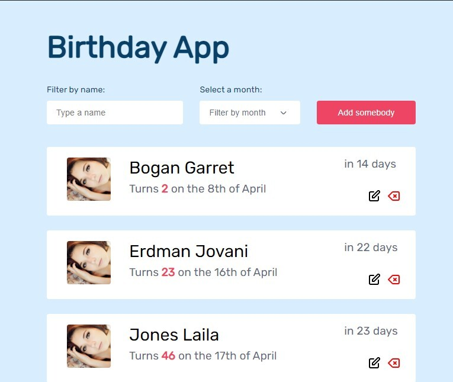

# Term 3 JS Project : Birthday App

This propect shows a list of people and their birthdays.

## Project Overview

## Description:

- When loading, a list of people is displayed on the page and sorted by the nearest future birthday.
- The list is initialised with the data from local storage.
- Users can add, edit and delete people from the list.
- Users can filter the list by their first names, last names and by birthday month.
- Every action is persisted into the local storage.

## How to use

- You will need to clone this repo https://github.com/Voninkazo/birthday-app.
- Run `npm install`.
- Ensure you have `live-server` and `parcel` installed globally in order to preview it in your browser.

## Design
https://www.figma.com/file/bb1Mie5R3mUhR77PtGG8bJ/Birthday-App?node-id=0%3A1

## Live app

https://birthday-app-sandy.netlify.app/
